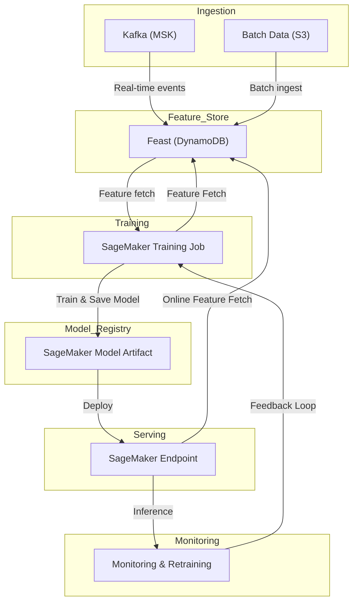
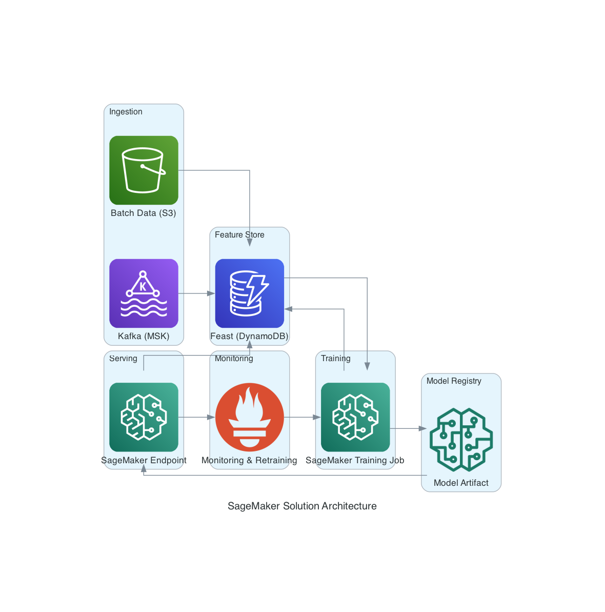

# Real-Time Demand Forecasting Pipeline for Retail

This repository implements a real-time demand forecasting pipeline for a large retailer using a Lambda architecture.

## Architecture Overview

This project supports two deployment options:

### 1. Standalone (Default)
- **Ingestion**: Kafka for real-time sales events, batch ingestion from S3 for historical data (Python scripts)
- **Feature Store**: Feast for consistent feature serving (DynamoDB as online store)
- **Model**: Prophet or Transformer-based model, trained via local scripts or custom jobs (not SageMaker)
- **Orchestration**: Temporal or Airflow for workflow management
- **Serving**: Low-latency inference via Kubernetes with HPA (Horizontal Pod Autoscaling)
- **Monitoring**: Track forecast accuracy (MAPE), drift detection, and scheduled retraining
- **IaC**: [iac/cloudformation.yaml](iac/cloudformation.yaml) for Kafka, DynamoDB, Lambda, etc.

### SageMaker Solution Architecture

**Ingestion/Feature Engineering/Training**: Packaged as SageMaker Processing/Training jobs
**Model**: Trained and deployed using AWS SageMaker (see [iac/cloudformation_sagemaker.yaml](iac/cloudformation_sagemaker.yaml))
**Serving**: SageMaker Endpoint for inference
**IaC**: [iac/cloudformation_sagemaker.yaml](iac/cloudformation_sagemaker.yaml) for SageMaker resources

> **Note:** The default repo setup is for the standalone approach. Use the SageMaker template if you want a fully managed ML workflow on AWS.

## Directory Structure

- `ingestion/` — Real-time and batch data ingestion code
- `feature_store/` — Feature engineering and Feast integration
- `model/` — Model training and inference code
- `orchestration/` — Workflow orchestration (Airflow/Temporal)
- `serving/` — Model serving and Kubernetes deployment
- `monitoring/` — Monitoring, drift detection, and retraining logic

## AI Models and Frameworks

- **Model**: Prophet (interpretable, robust for business time series), Transformer-based models (deep learning for complex patterns)
- **Frameworks**: PyTorch or TensorFlow (for deep learning), Prophet (Python library)
- **Why**: Prophet is fast, interpretable, and handles seasonality. Transformers capture complex dependencies. PyTorch/TensorFlow are scalable and supported by SageMaker.

> **Model Training:**
> - In the default (standalone) setup, model training is performed by local scripts (see `model/train.py`).
> - The SageMaker pipeline (`model/sagemaker_pipeline.py`) and the SageMaker IaC template are provided as an optional, fully managed alternative.

## Getting Started

1. Clone the repo
2. See each subdirectory for setup and usage instructions
3. Replace placeholders with your cloud and infrastructure details

## Notes
- This is a scaffold. Fill in each module as needed for your stack.
- Example configs and code templates are provided.

---

## Module Summaries

### ingestion/
- `kafka_consumer.py`: Consumes real-time sales events from Kafka and writes to feature store or S3.
- `batch_loader.py`: Loads historical sales data from S3 for batch processing.
- `config/`: Example configs for Kafka and S3.

### feature_store/
- `feast_feature_repo.py`: Defines Feast feature sets (price, promotion, seasonality, etc).
- `materialize.py`: Materializes features for training and serving.
- `config/`: Feast configuration files.

### model/
- `train.py`: Trains Prophet or Transformer-based models on historical data.
- `inference.py`: Runs batch or real-time inference.
- `sagemaker_pipeline.py`: Example SageMaker training pipeline.
- `requirements.txt`: Model dependencies.

### orchestration/
- `airflow_dag.py`: Example Airflow DAG for daily retraining and batch jobs.
- `temporal_workflow.py`: Example Temporal workflow for real-time orchestration.

### serving/
- `app.py`: FastAPI or Flask app for model inference API.
- `Dockerfile`: Containerizes the serving app.
- `k8s_deployment.yaml`: Kubernetes deployment with HPA example.

### monitoring/
- `monitor.py`: Tracks forecast accuracy (MAPE), detects drift, triggers retraining.
- `alerting.py`: Sends alerts on drift or performance issues.
- `config/`: Example monitoring configs.

---

Each module contains example code and configuration templates. Replace placeholders with your actual infrastructure and business logic as needed.
